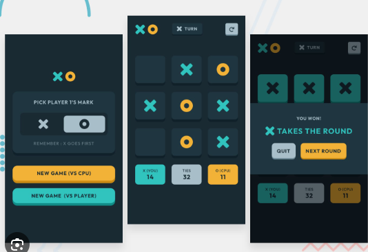

[Uploading README.md…]()
# Tic Tac Toe

A modern, feature-rich Tic Tac Toe game with local and cross-tab multiplayer support. Built with vanilla HTML, CSS, and JavaScript - no frameworks, no server required.



---

## Features

- **Two game modes** - Local same-tab play and Online cross-tab play
- **Match system** - First to 5 wins takes the match
- **Persistent leaderboard** - Win history stored across sessions via localStorage
- **Dark neon theme** - Animated glows, pop-in effects, and confetti on wins
- **Cross-tab multiplayer** - Real-time sync via localStorage storage events (no server)
- **Disconnect detection** - Heartbeat system alerts you if opponent leaves
- **Responsive** - Works on desktop, tablet, and mobile

---

## Getting Started

No build tools or dependencies needed for playing. Just open the file in a browser.

```bash
# Clone the repository
git clone https://github.com/KeithJapitana/claude-tictactoe-game.git
cd claude-tictactoe-game

# Open in browser
open index.html
# or on Windows
start index.html
```

### Running Tests

```bash
# Install dev dependencies
npm install

# Run the test suite
npm test

# Run with coverage report
npm run test:coverage

# Run in watch mode
npm run test:watch
```

---

## How to Play

### Local Mode

1. Enter both player names on the start screen
2. Click **Start Game**
3. Players take turns clicking empty cells - X goes first
4. First to get 3 in a row wins the game
5. First player to win **5 games** wins the match

### Online Mode (Cross-Tab)

**Creating a room (Player 1):**

1. Select **Online (Same Device)** on the start screen
2. Enter your name and click **Create Room**
3. A 4-character room code appears - share it with your opponent

**Joining a room (Player 2):**

1. Open the game in a **new tab or window**
2. Select **Online (Same Device)**
3. Click **Join a Room**, enter your name and the room code
4. The game starts automatically once both players are connected

**During online play:**

- An online indicator shows whether your opponent is connected
- If your opponent disconnects, a modal lets you start a new room or return to the main menu
- "New Game" and "Reset Match" sync across both tabs

---

## Project Structure

```text
claude-tictactoe-game/
|- index.html              # Game UI and HTML structure
|- style.css               # Dark neon theme, animations, responsive layout
|- script.js               # Game logic, multiplayer sync, confetti system
|- package.json            # Dev dependencies and test scripts
|- jest.config.js          # Jest configuration
|- jest.setup.js           # Jest DOM setup
|- __tests__/
|  |- tictactoe.test.js    # Unit and integration tests
|- images/                 # Screenshots and assets
|- README.md
```

---

## Multiplayer Architecture

Cross-tab communication uses the browser's native `storage` event, which fires in every tab **except** the one that wrote to localStorage. This gives real-time sync with zero server infrastructure.

### localStorage Key Schema

All keys are prefixed with `ttt_` to avoid conflicts with other data.

| Key | Purpose |
|-----|---------|
| `ttt_room_{CODE}` | Room metadata - host name, guest name, status |
| `ttt_room_{CODE}_move` | Latest move - cell index, player, move number, timestamp |
| `ttt_room_{CODE}_signal` | Control signals - new-game, reset-match, leave |
| `ttt_room_{CODE}_heartbeat` | Heartbeat timestamp for disconnect detection |

### Disconnect Detection

Each tab writes a heartbeat every 3 seconds. If no heartbeat is received from the opponent for 9 seconds (+ 2-second grace period), the opponent is considered disconnected and the UI reflects that.

---

## Tech Stack

| Layer | Technology |
|-------|-----------|
| UI | HTML5, CSS3 (Grid, Flexbox, CSS Variables) |
| Logic | Vanilla JavaScript (ES6+) |
| Multiplayer | localStorage + `storage` events |
| Animation | Canvas API (confetti), CSS keyframes |
| Testing | Jest, jest-environment-jsdom |
| Storage | localStorage |

---

## Browser Support

| Browser | Minimum Version |
|---------|----------------|
| Chrome | 60+ |
| Firefox | 55+ |
| Safari | 12+ |
| Edge | 79+ |

---

## License

MIT
